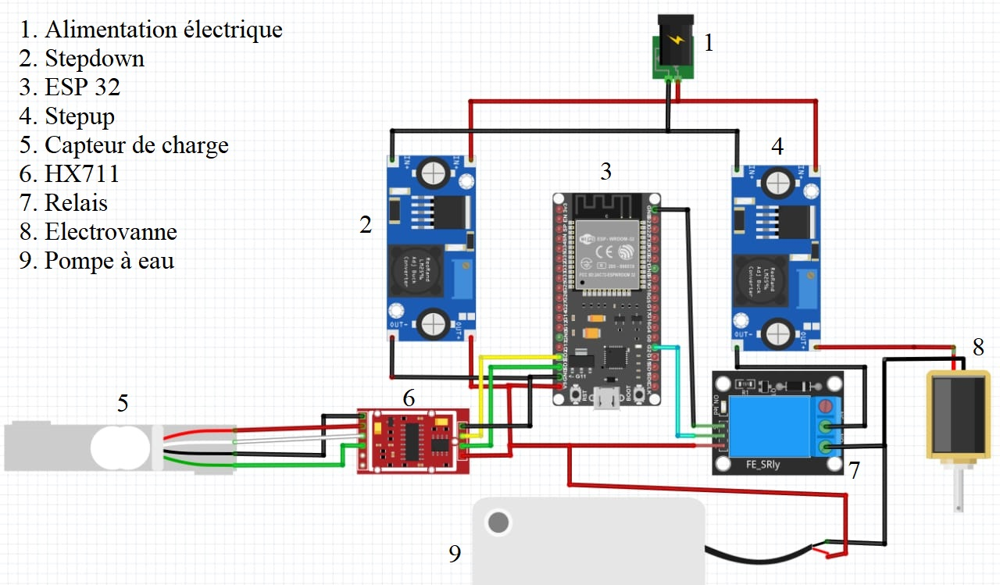
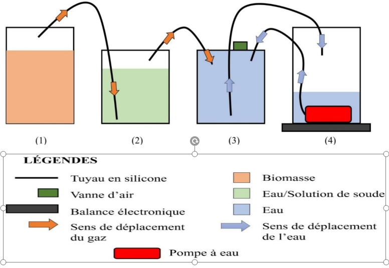
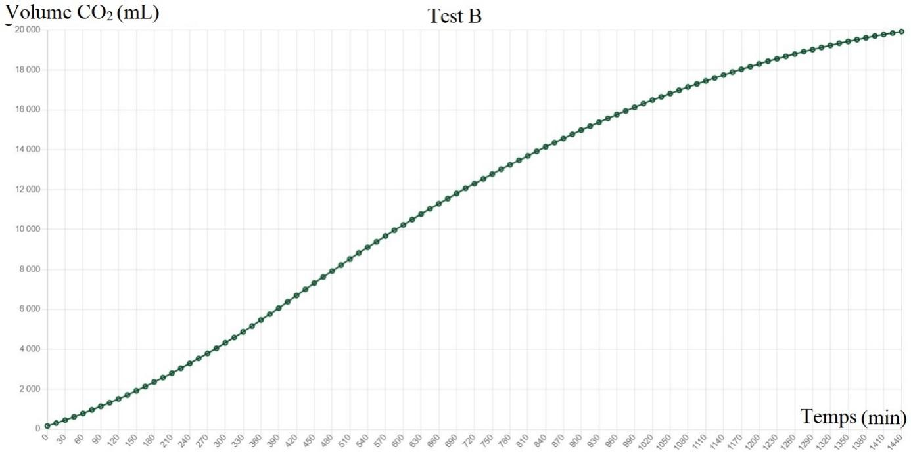

# 🌱 Système Automatique de Mesure de Débit et de Volume de Gaz lors d'une Digestion Anaérobique

Ce projet vise à concevoir et réaliser un **système automatique de mesure du volume de gaz** produit par digestion anaérobie. Il permet un suivi en temps réel et une collecte automatisée des données sans intervention humaine.

## 📜 Introduction
L’augmentation de la consommation énergétique et la nécessité de réduire les émissions de gaz à effet de serre poussent à développer des alternatives aux combustibles fossiles. Le **biogaz**, issu de la digestion anaérobie, représente une solution durable. Cependant, les dispositifs de mesure actuels sont coûteux et nécessitent une intervention manuelle.

Ce projet propose une alternative économique et automatisée permettant une mesure efficace et accessible.

## 🛠️ Matériel Utilisé

- **Alimentation 12v** : Pour alimenter l'appareil
-  **Stepdown** : Pour avoir un alimentation de 9V pour l'esp32
- **ESP32** : Microcontrôleur pour le traitement des données
- **Stepup** : Pour avoir une alimentation de 24V pour l'electrovane
- **Capteur de charge et HX711** : Mesure la quantiter déplacer
- **Relais**
- **Electrovanne** : Régulation des flux gazeux
- **Pompe à eau** : Régulation de flux d'eaux

## ⚙️ Schéma de Principe

Le système fonctionne sur le principe de la **mesure de volume de gaz par déplacement de liquide** ou par capteurs de pression, assurant une précision et une répétabilité des mesures.

## 📊 Fonctionnement et Algorithme
1. **Production de biogaz** dans le digesteur.
2. **Mesure du volume produit** via capteurs de pression ou déplacement de liquide.
3. **Enregistrement des valeurs en temps réel**.
4. **Transmission des données** vers une interface utilisateur accessible via WiFi.
5. **Stockage et analyse** des données pour optimisation du processus.
6. **Affichage des tendances et historiques** pour un meilleur suivi.

## 🏭 Applications Industrielles
✅ **Suivi en temps réel** des procédés de méthanisation. 
✅ **Optimisation des rendements énergétiques** en biogaz. 
✅ **Utilisation dans l’agriculture et le traitement des déchets**. 
✅ **Contrôle de la production de biogaz** pour les stations d’épuration et sites industriels. 
✅ **Surveillance des procédés de fermentation** en industrie agroalimentaire. 
✅ **Suivi des émissions de gaz industriels** pour le contrôle environnemental. 
✅ **Mesure des flux gazeux dans les laboratoires de recherche** pour des expériences chimiques et biologiques. 
✅ **Contrôle de la qualité de l’air** dans les environnements sensibles (hôpitaux, laboratoires, salles blanches). 
✅ **Analyse des processus de combustion** dans les industries de l’énergie. 
✅ **Utilisation dans l’industrie pétrochimique** pour le suivi des émissions gazeuses. 
✅ **Évaluation des performances des systèmes de ventilation et d’aération**.

## 🔬 Résultats Expérimentaux
### Courbes de Production de Biogaz

### Comparaison avec un Système Manuel
| Paramètre | Système Automatisé | Système Manuel |
|-----------|-----------------|-----------------|
| Précision | ±0.05 L | ±0.2 L |
| Temps de mesure | Temps réel | 1 mesure/h |
| Coût estimé | ~100€ | >500€ |

## 📌 Améliorations Futures
- **Intégration de l’intelligence artificielle** pour prédiction des performances.
- **Ajout d’un système de contrôle à distance** via application mobile/web.
- **Optimisation de l’autonomie énergétique** avec panneaux solaires.
- **Ajout de capteurs supplémentaires** pour surveiller d’autres gaz (CO2, H2S, O2).
- **Développement d’une version industrielle** pour des applications à grande échelle.

## 📝 Arborescence des fichiers
- Les codes de l'esp32 est disponible dans : **esp32_code/gaz_measure.ino**
- Les codes de l'interface utilisateur et du serveur sont disponibles dans : **Interface_&_server**
- le pdf complet du projet est disponible via une demande et requête à l'adresse mail suivante : [ing.emmanuela@gmail.com]

## 🧑‍🔬 Auteur
**Narindranjananahary Emmanuela** - [linkedin.com/in/emmanuela-narindranjanahary-7194272a7](www.linkedin.com/in/emmanuela-narindranjanahary-7194272a7)
